# YOLO Rock-Paper-Scissors Demo


[](https://github.com/VincentZyuApps/yolo-RPS-fastapi-demo-20260319)
[](https://gitee.com/vincent-zyu/yolo-RPS-fastapi-demo-20260319)

基于 YOLO + FastAPI 的石头剪刀布实时识别演示项目，支持摄像头采集、模型训练和实时检测。

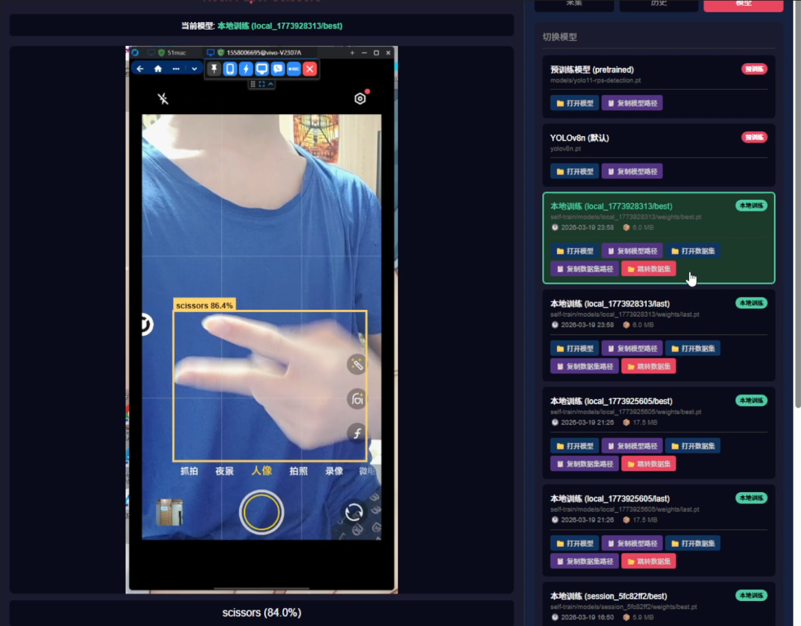

## 功能特性

- 🎯 实时手势检测（石头、剪刀、布）
- 📹 支持摄像头和窗口捕获两种模式
- 📊 数据采集与自动标注
- 🤖 本地模型训练
- 📈 模型性能分析可视化
- 🌐 Web UI 界面
- 🔲 检测框实时显示

## 技术栈

### 后端

| 技术 | 版本 | 说明 |
|:---|:---|:---|
| [](https://python.org/) | 3.12+ | 编程语言 |
| [](https://fastapi.tiangolo.com/) | 0.109 | Web 框架 |
| [](https://github.com/ultralytics/ultralytics) | 8.4.23 | 目标检测框架 |
| [](https://pytorch.org/) | 2.7+cu118 | 深度学习框架 |
| [](https://opencv.org/) | 4.9 | 图像处理库 |
| [](https://www.uvicorn.org/) | 0.27 | ASGI 服务器 |
| [](https://github.com/python-websockets/websockets) | 12.0 | 实时通信 |
| [](https://docs.pydantic.dev/) | 2.12 | 数据验证 |
| [](https://numpy.org/) | 1.26 | 数值计算 |
| [](https://python-pillow.org/) | 12.1 | 图像处理 |

### 前端

| 技术 | 版本 | 说明 |
|:---|:---|:---|
| [](https://react.dev/) | 19.2.4 | UI 框架 |
| [](https://www.typescriptlang.org/) | 5.9 | 类型系统 |
| [](https://vitejs.dev/) | 8.0 | 构建工具 |
| [](https://recharts.org/) | 3.8 | 图表库 |
| [](https://reactrouter.com/) | 7.13 | 路由管理 |
| [](https://github.com/bubkoo/html-to-image) | 1.11 | 图片导出 |
| [](https://eslint.org/) | 9.39 | 代码检查 |
| [](https://babeljs.io/) | 7.29 | 编译器 |
| [](https://react.dev/learn/react-compiler) | 1.0 | 编译优化 |

## 快速开始

### 环境要求

- Python 3.12+
- Node.js 18+
- CUDA 11.8+（如需GPU训练）

### 1. 克隆项目

```bash
git clone https://github.com/VincentZyuApps/yolo-RPS-fastapi-demo-20260319
cd yolo-RPS-fastapi-demo-20260319
```

### 2. 后端设置

```bash
# 创建虚拟环境
uv venv --python 3.12

# 安装 PyTorch (CUDA 版本)
uv pip install torch torchvision --index-url https://download.pytorch.org/whl/cu118

# 安装其他依赖
uv pip install -r requirements.txt

# 复制配置文件
cp config.example.yaml config.yaml
```

### 3. 前端设置
```bash
cd frontend
npm install
cd ..
```

### 4. 启动服务

#### 方式一：开发模式（推荐开发时使用）

同时启动后端和前端开发服务器：

```bash
cd frontend
npm install   # 首次需要安装依赖
npm run dev
```

- 后端 API: http://localhost:60319
- 前端页面: http://localhost:60320

#### 方式二：生产模式（推荐部署时使用）

先构建前端，然后只启动后端：

```bash
cd frontend
npm install   # 首次需要安装依赖
npm run build
npm run start
```

- 统一访问: http://localhost:60319

后端会自动检测静态文件是否存在，如果存在则直接提供前端页面，否则重定向到前端开发服务器。

## 项目结构

```
yolo-rps-demo/
├── app/                    # 后端应用
│   ├── camera/            # 摄像头/窗口捕获
│   ├── collect/           # 数据采集与训练
│   ├── detection/         # YOLO 检测
│   └── main.py            # FastAPI 入口
├── frontend/              # React 前端
│   ├── src/
│   │   ├── components/    # 组件
│   │   ├── hooks/         # 自定义 Hooks
│   │   ├── services/      # API 服务
│   │   └── styles/        # 样式
│   └── package.json
├── models/                # 模型文件
├── self-train/            # 训练数据与结果
│   ├── sessions/          # 采集会话
│   └── models/            # 训练好的模型
├── test/                  # 测试脚本
├── config.example.yaml    # 配置模板
├── requirements.txt       # Python 依赖
└── run.py                 # 启动脚本
```

## 配置说明

编辑 `config.yaml`：

```yaml
# ============================================
# 🖥️  服务器配置
# ============================================
host: "0.0.0.0"           # 🌐 监听地址，0.0.0.0 表示所有网卡
port: 60319               # 🔌 监听端口

# ============================================
# 📹 视频采集配置
# ============================================
capture_mode: "camera"    # 🎬 采集模式: "camera" 或 "window"
camera_index: 0           # 📷 摄像头索引 (capture_mode=camera时使用)
window_hwnd: null         # 🪟 窗口句柄 (capture_mode=window时使用，Windows上可用 test/list_windows.py 获取)

# ============================================
# 🤖 模型配置
# ============================================
model_source: "pretrained"                      # 📦 模型来源: "pretrained"(预训练) 或 "custom"(自定义训练)
model_path: "models/yolo11-rps-detection.pt"   # 📁 模型路径(相对或绝对路径)

# ============================================
# 🌍 代理配置
# ============================================
use_proxy: false              # 🔀 是否使用代理下载模型
proxy_url: "http://127.0.0.1:7890"  # 🌐 代理地址

# ============================================
# 📚 数据集配置
# ============================================
# 🎯 目标检测模型：石头剪刀布识别
roboflow_dataset: models/rock-paper-scissors.v11-yolov8n-100epochs.yolov11

# ============================================
# 🎨 检测框显示配置
# ============================================
bbox_refresh_interval: 100  # ⏱️ 检测框刷新间隔，单位毫秒，默认100ms (10fps)
```

## Web UI 使用说明

### 标签页

| 标签 | 功能 |
|:---|:---|
| **采集** | 采集手势数据用于训练 |
| **历史** | 查看历史采集会话 |
| **模型** | 切换和管理模型 |
| **分析** | 查看模型训练结果和性能指标 |

### 快捷键

采集模式下：
- `R` - 采集石头
- `P` - 采集布
- `S` - 采集剪刀
- `Q` - 停止采集

## 代码检查

### Python (Ruff)

```bash
# 检查代码
uv tool run ruff check .

# 自动修复
uv tool run ruff check . --fix
```

### 前端 (Biome)

```bash
cd frontend
npx @biomejs/biome check ./src
```

## 开发环境参考

- OS: Windows 11 / WSL2 Ubuntu 22.04
- GPU: NVIDIA RTX 3060 12GB
- Python: 3.12
- Node.js: 22.17.0

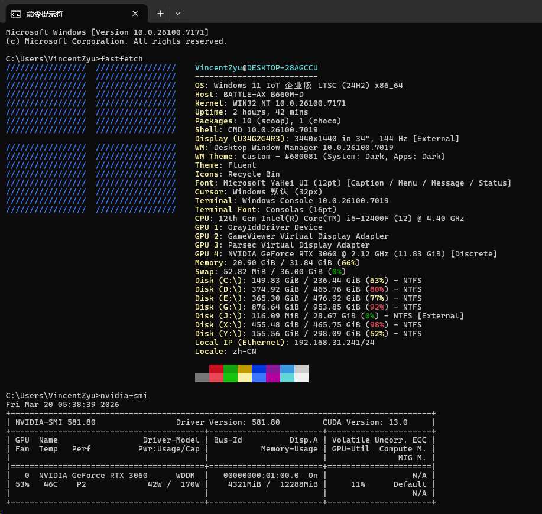

### 训练报告示例

<table>
  <tr>
    <th align="center" colspan="2">📊 模型性能指标</th>
  </tr>
  <tr>
    <td align="center" colspan="2">
      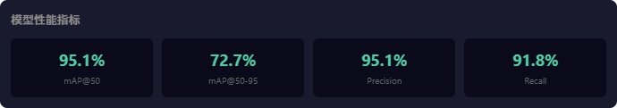
    </td>
  </tr>
  <tr>
    <th align="center" width="50%">📈 训练结果</th>
    <th align="center" width="50%">🔀 混淆矩阵</th>
  </tr>
  <tr>
    <td align="center" width="50%">
      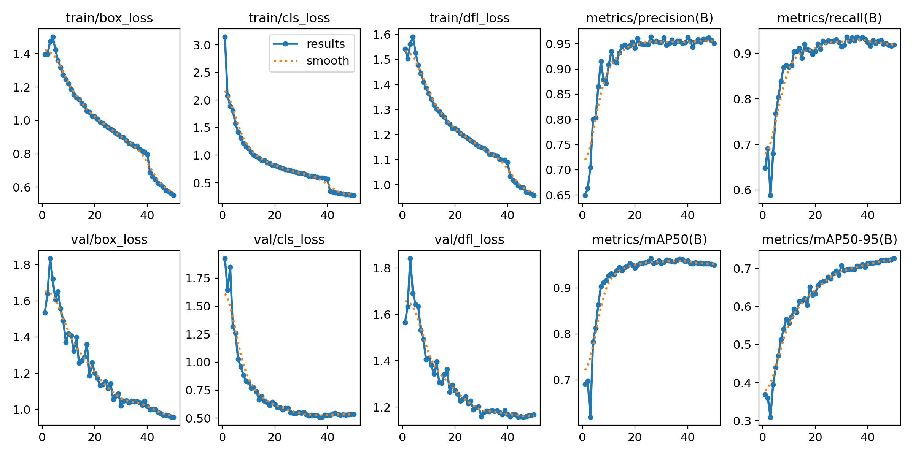
    </td>
    <td align="center" width="50%">
      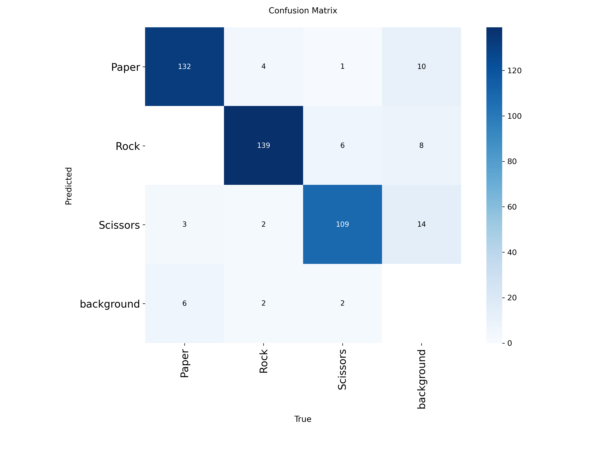
    </td>
  </tr>
  <tr>
    <th align="center" width="50%">📊 归一化混淆矩阵</th>
    <th align="center" width="50%">📉 Precision-Recall 曲线</th>
  </tr>
  <tr>
    <td align="center" width="50%">
      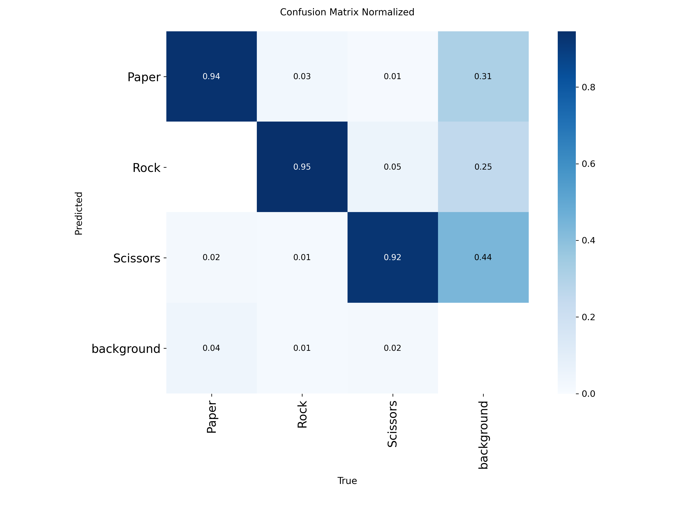
    </td>
    <td align="center" width="50%">
      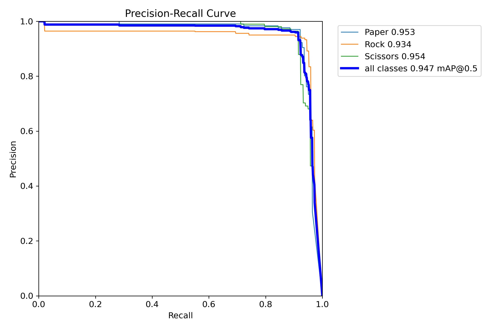
    </td>
  </tr>
  <tr>
    <th align="center" colspan="2">📈 训练曲线</th>
  </tr>
  <tr>
    <td align="center" colspan="2">
      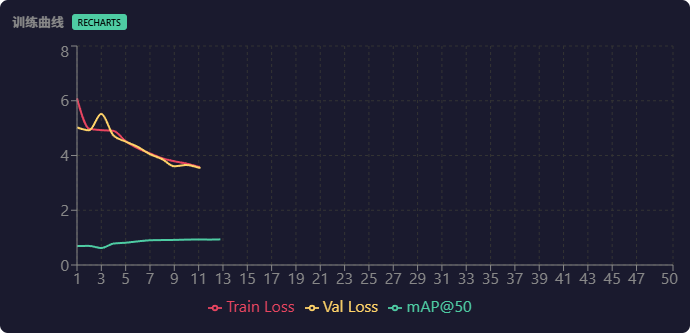
    </td>
  </tr>
  <tr>
    <th align="center" width="50%">🖼️ 训练批次示例</th>
    <th align="center" width="50%">🆚 验证批次对比</th>
  </tr>
  <tr>
    <td align="center" width="50%">
      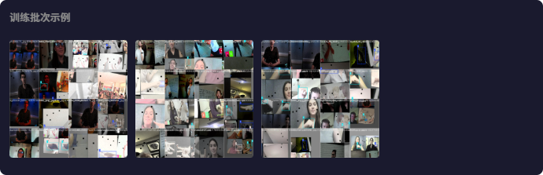
    </td>
    <td align="center" width="50%">
      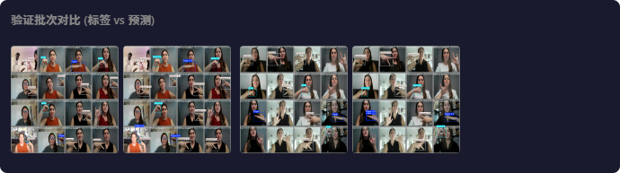
    </td>
  </tr>
  <tr>
    <th align="center" colspan="2">⚙️ 训练参数</th>
  </tr>
  <tr>
    <td align="center" colspan="2">
      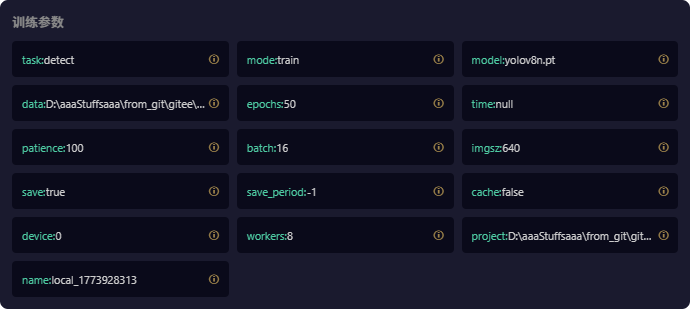
    </td>
  </tr>
</table>
